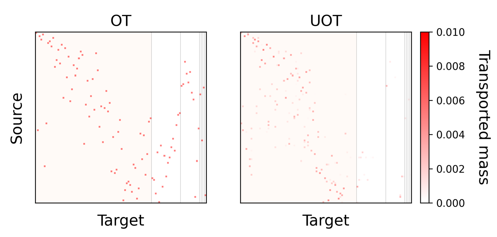
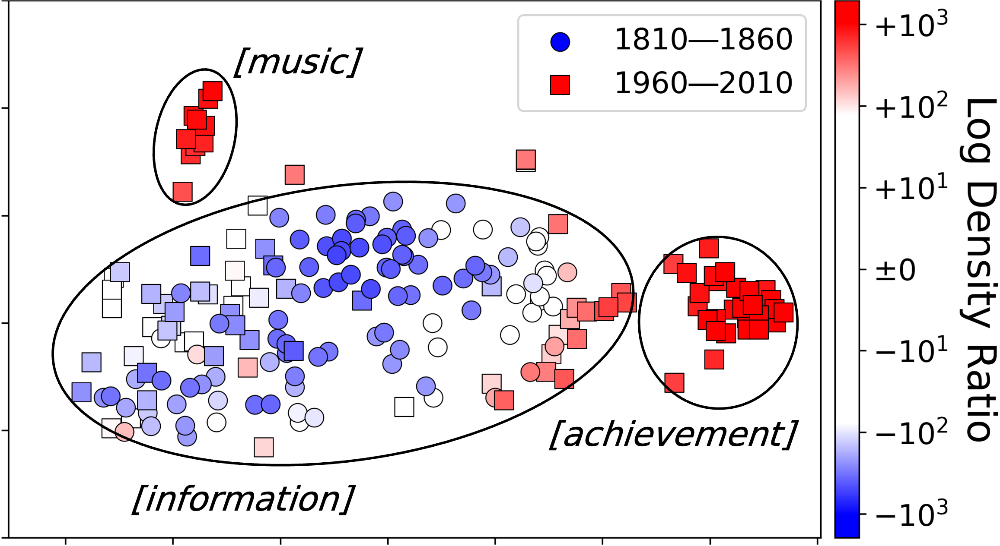

# Semantic-Shift-via-UOT
> [Quantifying Lexical Semantic Shift via Unbalanced Optimal Transport](https://arxiv.org/abs/2412.12569)                 
> [Ryo Kishino](https://ryo-lyo.github.io/), [Hiroaki Yamagiwa](https://ymgw55.github.io/), [Ryo Nagata](https://researchers.adm.konan-u.ac.jp/html/33_en.html), [Sho Yokoi](https://www.cl.ecei.tohoku.ac.jp/~yokoi/), [Hidetoshi Shimodaira](https://stat.sys.i.kyoto-u.ac.jp/members/shimo/)
> *ACL 2025 (to appear)*

<div style="text-align: center;">
<table>
  <tr>
    <th colspan="2" style="text-align:center;">Optimal Transport</th>
  </tr>
  <tr>
    <td></td>
  </tr>
</table>
<table>
  <tr>
    <th colspan="2" style="text-align:center;">Unbalanced Optimal Transport</th>
  </tr>
  <tr>
    <td></td>
  </tr>
</table>
</div>


## Setup

### Python Environment

First, create a virtual environment and install the required packages:

```bash
$ python -m venv .venv
$ source .venv/bin/activate
$ pip install -r requirements.txt
```

Next, download and install the pre-trained language model ([XL-LEXEME](https://aclanthology.org/2023.acl-short.135/) [1]):

```bash
$ git clone https://github.com/pierluigic/xl-lexeme.git
$ cd xl-lexeme
$ pip install .
```

For executing the [APP clustering](https://aclanthology.org/2022.lchange-1.4/) [2], you also need to clone the CSSDetection repository [3]:

```bash
$ git clone https://github.com/FrancescoPeriti/CSSDetection
```

### Dataset

Download the [DWUG](https://aclanthology.org/2021.emnlp-main.567/) [4] dataset for English:

```bash
$ bash scripts/get_dwug.sh
```

## Code

### Save Embeddings

First, you need to calculate the contextual embeddings for the DWUG dataset. This step uses the pre-trained language model (XL-LEXEME) to compute word embeddings for each word in each of its contexts. The resulting embeddings will be saved in the `embeddings/` directory.

```bash
$ python src/calc_embeddings.py
```

### Fig. 1: Visualizing Semantic Shift Using SUS

To visualize the semantic shift using the SUS (Semantic Usage Shift) metric, you can run the following commands. This will generate t-SNE plots for target words (e.g., *"record"* and *"ball"*), visualizing their semantic shift. You can specify different target words by changing the `--tgt_word` argument (default is "record_nn").

```bash
$ python src/fig1.py --tgt_word "record_nn"
$ python src/fig1.py --tgt_word "ball_nn"
```

<table style="margin: auto; text-align: center;">
  <tr>
    <th style="text-align: center; width: 35%;"><em>record</em></th>
    <th style="text-align: center; width: 35%;"><em>ball</em></th>
  </tr>
  <tr>
    <td style="text-align: center;">
      
    </td>
    <td style="text-align: center;">
      
    </td>
  </tr>
</table>


### Fig. 3: Comparing OT and UOT Transportation Matrix

This code visualizes the transportation matrix for the OT (Optimal Transport) and UOT (Unbalanced Optimal Transport). You can specify different target words by changing the `--tgt_word` argument (default is "record_nn").

```bash
$ python src/fig3.py
```

<div align="center">

</div>

### Fig. 4: Visualizing Distribution of SUS

This code visualizes the distribution of SUS for the specified target words. You can specify different target words by changing the `--tgt_word` argument (default is "record_nn").

```bash
$ python src/fig4.py --tgt_word "record_nn"
$ python src/fig4.py --tgt_word "ball_nn"
```

<table style="margin: auto; text-align: center;">
  <tr>
    <th style="text-align: center; width: 35%;"><em>record</em></th>
    <th style="text-align: center; width: 35%;"><em>ball</em></th>
  </tr>
  <tr>
    <td style="text-align: center;">
      
    </td>
    <td style="text-align: center;">
      
    </td>
  </tr>
</table>


### Fig. 5: Visualizing Semantic Shift Using LDR or Gold Sense

This code visualizes the semantic shift using the LDR (Log Density Ratio) or gold sense.

```bash
$ python src/fig5a.py
$ python src/fig5b.py
```

<div align="center">
  
  
</div>

### Table 2 and Fig. 6: Evaluation of Quantifying Instance-Level Shift

This code evaluates the method for quantifying instance-level semantic shift using SUS, LDR and WiDiD.

```bash
$ python src/fig6.py
$ python src/table2.py
```

<div align="center">

</div>

### Table 3: Evaluation of Quantifying Magnitude of Word-Level Shift

This code evaluates the method for quantifying the magnitude of word-level semantic shift using SUS, LDR, WiDiD, and other metrics.
```bash
$ python src/table3.py
```

### Table 4: Evaluation of Quantifying Word-Level Shift in Semantic Scope

This code evaluates the method for quantifying word-level semantic shift in semantic scope using SUS, LDR, WiDiD, and other metrics.

```bash
$ python src/table4.py
```

## References
[1] Cassotti et al. XL-LEXEME: WiC Pretrained Model for Cross-Lingual LEXical sEMantic changE. ACL. 2023.

[2] Periti et al. What is Done is Done: an Incremental Approach to Semantic Shift Detection. LChange. 2022.

[3] Periti and Tahmasebi. A systematic comparison of contextualized word embeddings for lexical semantic change. NAACL. 2024.

[4] Schlechtweg et al. DWUG: A large Resource of Diachronic Word Usage Graphs in Four Languages. EMNLP. 2021.

## Citation

If you find our code or data useful in your research, please cite our paper. Until the official ACL Anthology version is available, please cite the arXiv version as follows:

```bibtex
@misc{kishino2025quantifyinglexicalsemanticshift,
      title={Quantifying Lexical Semantic Shift via Unbalanced Optimal Transport}, 
      author={Ryo Kishino and Hiroaki Yamagiwa and Ryo Nagata and Sho Yokoi and Hidetoshi Shimodaira},
      year={2025},
      eprint={2412.12569},
      archivePrefix={arXiv},
      primaryClass={cs.CL},
      url={https://arxiv.org/abs/2412.12569}, 
}
```


## Note
This directory was created by Ryo Kishino. Part of the code was developed with support from Hiroaki Yamagiwa.